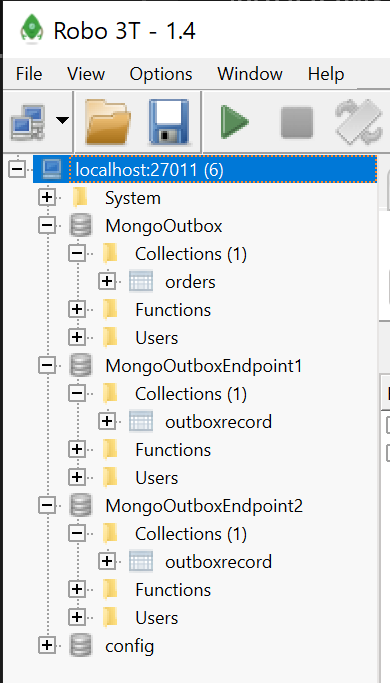
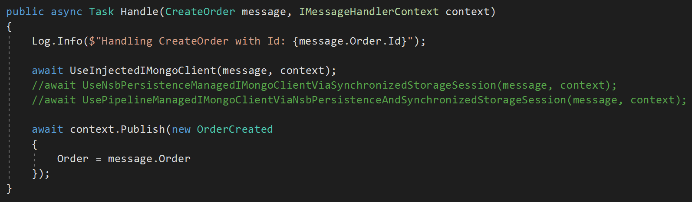

# MongoOutbox
This repo demonstrates how to use NServiceBus Outbox with MongoDb for persistence with RabbitMQ as the transport.

Although the handlers in the project contain a direct reference to `var session = context.SynchronizedStorageSession.GetClientSession();` to get a hold of the NSB Persistence managed IMongoDbClient, there are ways to use the NServiceBus pipeline to write behaviors which can "float" the context into handlers remembering to first get, then assign the session (`IClientHandleSession`) in the handler code is taken care of by NSB infrastrcutrue code.

At a high level, there are three endpoints: 
- .Client, which is run as a SendOnly endpoint. This endpoint sends a new CreateOrder command to Enpoint1 every 5 seconds.
- .Endpoint1, which handles CreateOrder. In the handler, an "Order" in inserted into the Mongo and an OrderCreated event is published
- .Endpoint2, which handler OrderCreated. In the handler, it prints out the info of the event to the console.

You'll need docker installed and running and .NET Core 3.1 on your machine in order to run the solution.

## Running the Docker Containers
The docker-compose.yml file stands up a replica set of MongoDb (required to run NServiceBus persistence) and RabbitMQ.

In order to build all the contaiers the solution relies on, follow these steps:

- run `docker-compose up` in the root repo directory. This will fetch the latest MongoDb and RabbitMQ images (if not already present on your computer) and start up a MongoDb replica set and RabbitMQ broker.
- in order to add each instance of mongo to the replica set, open a new console as administrator and execute the following commands
     - `docker exec -it mongo1 /bin/bash`
     - `mongo`
     - `rs.initiate( { _id : 'rs0', members: [ { _id : 0, host : "mongo1:27017" }, { _id : 1, host : "mongo2:27017" }, { _id : 2, host : "mongo3:27017" } ] })`
     
this will add all MongoDb instances to the `rs0` replica set.

To connect to the replica set, download Robot 3T (a mongo client) and connect to the three instances like this:
- localhost:27011 (master)
- localhost:27012 (master)
- localhost:27013 (master)

27011 is primary, 012 and 013 are the secondaries (or replicas). There is no security for any of the databases.

To access RabbitMQ administration, go to http://localhost:15672/ with username `rabbitmq` and password `rabbitmq`.

> NOTE: all containers are configured to save data to volumes so both the mongo and rabbit data will survive container restarts via `docker-compose down`. If you want to blow away the data on the volumes, simply run `docker-compose down -v`.

## Running the Solution
To run the solution, check that the MongoOutbox solution has three projects set to startup:
- MongoOutbox.Client
- MongoOutbox.Endpoint1
- MongoOutbox.Endpoint2

Next, hit F5. All three endpoints should stand up. 

- After a 10 second delay (to alllow Endpoint1 and Endpoint2 to start up and provision the rabbit topology), the .Client project will send a CreateOrder command every 5 seconds. 
- Endpoint1 will handle CreateOrder, insert an Order into Mongo, then publish the OrderCreated event. 
- Endpoint2 will handle OrderCreatedand and write to consle that the event was handled (there are no db ops in this endpoint).

This is what the MongoDb databases and collection in each database should look like:

- MongoOutbox: this database holds a combination of outbox data (outboxrecord) for othe endpoint and business data, aka, where Orders are written. Co-locating your outbox and business data in the same database is a NServiceBus best practice when using Outbox.
- MongoOutboxEndpoint2: this is MongoOutbox.Endpoint2's outbox storage. There is nothing else being stored here because this endpoint does not write any business data to a database.

By convention, NServiceBus will create a mongo database per endpoint named after the endpoint name. The name, as well as connection string and port are overridable in endpoint config.

## Writing Business Data and Outbox Data in the Same Transaction
Best practices around [tranaction scope](https://docs.particular.net/nservicebus/outbox/#important-design-considerations-transaction-scope) when using mongo for NServiceBus persistence in the context of using Outbox recommend putting outbox data and business data in the same database if possible:

> "Transactions scoped to a single database are supported by all persisters and usually have the best performance, so it is usually best to store outbox data in the same database as business data."

If you look at CreateOrderHandler:

There are three examples in this handler of tying mongo business data and outbox data together in the same db transaction:
1. Using an injected `IMongoClient` managed by .NET Core DI container (registered as singleton). The `IMongoCollection` that is retrieved via this injected instance needs to be "tied" into the IClientSessionHandle of the NSB Persistence managed IMongoClient in order to allow both business and outbox data to be commited in the same transaction.
2. Don't inject an IMongoClient and instead, obtain an IMongoDatabase instance from the NSB Persistence managed `SynchronizedStorageSession`. This way, when invoking a db operation on your mongo collection, you don't have to pass in the NSB Persistence managed session, you're already using it.
3. Encapsulate some of that behavior of #2 in an NSB Behavior. The `SynchronizedStorageSessionBehavior` uses the NSB Persistence managed IMongoClient to obtain and instance of IMongoDatabase, then sets that instance in the ContextBag of `IMessageHandlerContext`. `MessageHandlerContextExtensions` expose a `GetDatabase` extension method which gets the IMongoDatabase instace from the `IMessageHandlerContext` ContextBag and returns it into the handler. The nice part about this appraoch is devs don't have to remember to call `context.SynchronizedStorageSession.GetClientSession();`, and the extension method is right off the messgae context in the handler.

The CreateOrderHandler uses `UseInjectedIMongoClient` by default. To try out the other ways to tie business and outbox data together in the same transaction, try out `UseNsbPersistenceManagedIMongoClientViaSynchronizedStorageSession` and `UsePipelineManagedIMongoClientViaNsbPersistenceAndSynchronizedStorageSession` as well.

> NOTE: make sure only one of the three methods is uncommented at any one time when running the solution 