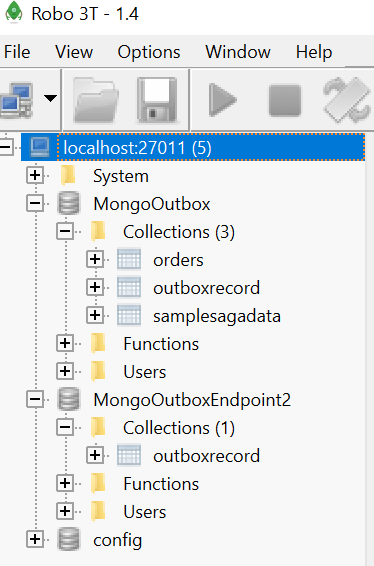

# MongoOutbox

This repo demonstrates how to use NServiceBus Outbox with MongoDb for persistence with RabbitMQ as the transport.

Although the handlers in the project contain a direct reference to `var session = context.SynchronizedStorageSession.GetClientSession();` to get a hold of the NSB Persistence managed IMongoDbClient, there are ways to use the NServiceBus pipeline to write behaviors which can "float" the context into handlers remembering to first get, then assign the session (`IClientHandleSession`) in the handler code is taken care of by NSB infrastrcutrue code.

At a high level, there are three endpoints: 
- .Client, which is run as a SendOnly endpoint. This endpoint sends a new CreateOrder command to Enpoint1 every 5 seconds.
- .Endpoint1, which handles CreateOrder. In the handler, an "Order" in inserted into the Mongo and an OrderCreated event is published
- .Endpoint2, which handler OrderCreated. In the handler, it prints out the info of the event to the console.

You'll need docker installed and running and .NET Core 3.1 on your machine in order to run the solution.

## Running the Docker Containers
The master branch contains a docker-compose.yml file that stands up a replica set of MongoDb (required to run NServiceBus Outbox using MongoDb as persistence) and RabbitMq.

In order to run the code in the master branch, follow these steps

- run `docker-compose up` in the root repo directory. This will fetch the latest MongoDb images (if not already present on your computer) and start up a MongoDb replica set.
- in order to add each instance to the replica set, open a new console as administrator and execute the following commands
     - `docker exec -it mongo1 /bin/bash`
     - `mongo`
     - `rs.initiate( { _id : 'rs0', members: [ { _id : 0, host : "mongo1:27017" }, { _id : 1, host : "mongo2:27017" }, { _id : 2, host : "mongo3:27017" } ] })`
     
this will add all MongoDb instances to the `rs0`replica set.

To connect to the replica set, download Robot 3T (a mongo client) and connect to the three instances like this:
- localhost:27011 (master)
- localhost:27012 (master)
- localhost:27013 (master)

27011 is primary, 012 and 013 are the secondaries (or replicas). There is no security for any of the databases.

To access RabbitMQ administration, go to http://localhost:15672/ with username `rabbitmq` and password `rabbitmq`.

## Running the Solution
To run the solution, check that the MongoOutbox solution has three projects set to startup:
- MongoOutbox.Client
- MongoOutbox.Endpoint1
- MongoOutbox.Endpoint2

Next, hit F5. All three endpoints should stand up. .Client will send a new command, CreateOrder, every 5 seconds. Endpoint1 will handle CreateOrder, insert an Order into Mongo, then publics an event, OrderCreated. Endpoint2 will handle the OrderCreated event and simply write to consle that the event was handled.

This is what the MongoDb databases and collection in each database should look like:

- MongoOutbox: this is the "business" database. Aka, where Orders are written. It has nothing to do with NSB Outbox
- MongoOutboxEndpoint1: this is MongoOutbox.Endpoint1's outbox storage
- MongoOutboxEndpoint2: this is MongoOutbox.Endpoint2's outbox storage

By convention, NServiceBus keeps an outbox storage db per endpoint.

## Writing Business Data and Outbox Data in the Same Transaction
If you look at CreateOrderHandler:

You'll see there are three ways to tie mongo business data and outbox data together in the same db transaction:
1. Using an injected `IMongoClient` managed by .NET Core DI container (registered as singleton). The `IMongoCollection` that is retrieved via this injected instance needs to be "tied" into the IClientSessionHandle of the NSB Persistence managed IMongoClient in order to allow both business and outbox data to be commited in the same transaction.
2. Don't inject an IMongoClient and instead, obtain an IMongoDatabase instance from the NSB Persistence managed `SynchronizedStorageSession`. This way, when invoking a db operation on your mongo collection, you don't have to pass in the NSB Persistence managed session, you're already using it.
3. Encapsulate some of that behavior of #2 in an NSB Behavior. The `SynchronizedStorageSessionBehavior` uses the NSB Persistence managed IMongoClient to obtain and instance of IMongoDatabase, then sets that instance in the ContextBag of `IMessageHandlerContext`. The `MessageHandlerContextExtensions` creates a `GetDatabase` convinence method which gets the IMongoDatabase instace from the 'IMessageHandlerContext' ContextBag and returns it into the handler. The nice part about this appraoch is devs don't have to remember to call `context.SynchronizedStorageSession.GetClientSession();`, and the extension method is right off the messgae context in the handler.

The solution uses the `UseInjectedIMongoClient` be default. To try out the other ways to tie business and outbox data together in the same transaction, try out `UseNsbPersistenceManagedIMongoClientViaSynchronizedStorageSession` and `UsePipelineManagedIMongoClientViaNsbPersistenceAndSynchronizedStorageSession` as well

> NOTE: make sure only one of the three methods is uncommented at any one time when running the solution 

